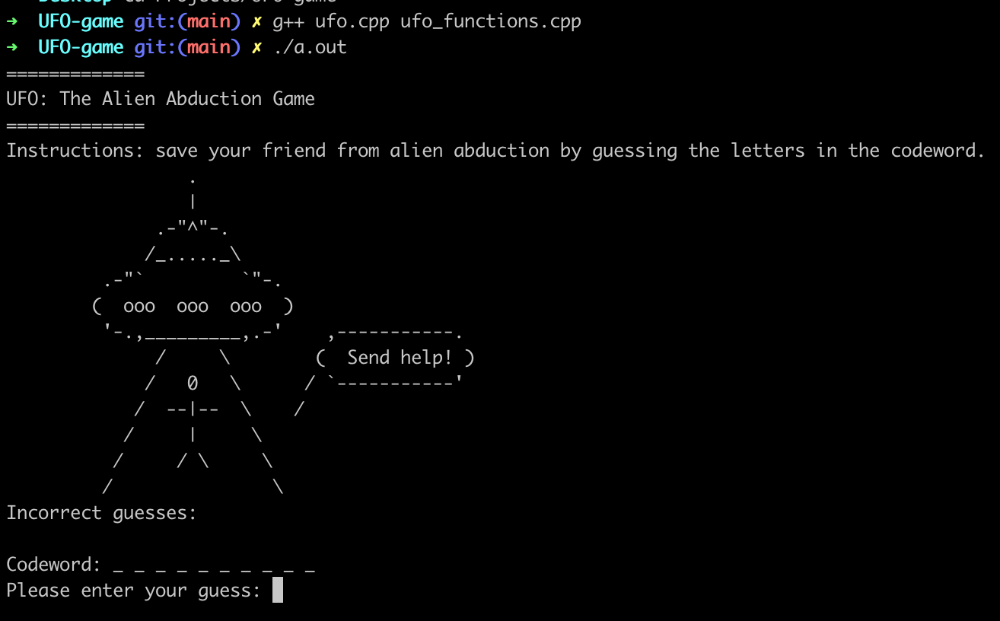

# UFO: The Game

Welcome to UFO: The Game, a simple yet entertaining C++ program that challenges you to save your friend from alien abduction! Crack the codeword using the Command Line Interface (CLI) and enjoy a fun guessing game.
This was part of a challenge using function templates in C++ and use of header file.

## How to Run

1. **Clone the Repository:**
   ```bash
   git clone https://github.com/alessandro-001/UFO-game.git
   cd ufo-game
   ```

2. **Compile the Program:**
    ```bash
    g++ ufo.cpp ufo_functions.cpp
    ```

3. **Run the Program:**
    ```bash
    ./a.out
    ```
4. **Play!**

## Gameplay Instructions
Guess the letters in the codeword to save your friend from alien abduction.
You have a limited number of attempts before the UFO flies away!

## Screenshots
<div style="justify-content: center;">
  
</div>

## Contributions
Contributions are welcome! If you find any issues or have suggestions for improvements, feel free to create a pull request or open an issue.

